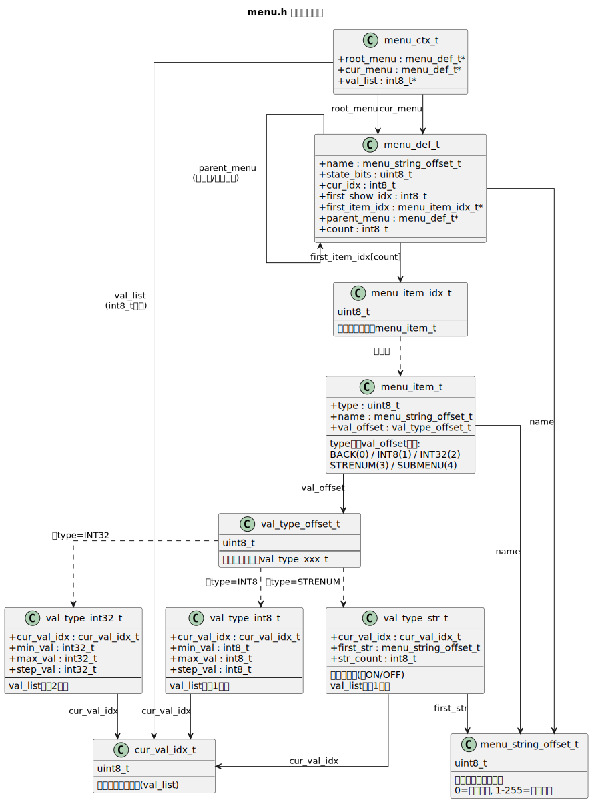

# MT06xx UHF无线音频接收机项目

## 项目概述

这是一个基于STC8H1K17单片机+KT0656M的UHF无线话筒接收机项目,双通道接收,旋转编码器输入,菜单设置,OLED128x64输出.

## 项目起因

事情的起因是在小黄鱼捡垃圾捡到了便宜的UHF话筒,但是没有适配的接收机,所以把话筒拆开发现是 SH88F4051AX + KT0646M 的方案,刮了I2C的线路并且捕获了芯片初始化和设置通道的数据,计算得到了话筒的频率.

随后便了解到这个UHF方案已经有 xytoki 大佬探索过 https://github.com/xytoki/kt06xx 便开始的UHF接收机的复刻

https://oshwhub.com/xytoki/wmic-kt06 给了我很大的信心和真正的帮助,但是真正在实现的时候仍然踩坑不少.

## 项目特性

### 硬件特性
- **主控芯片**: STC8H1K17 (QFN-20超小封装)
- **无线芯片**: KT0656M (仅支持0x11版本)
- **显示**: 128x64 OLED屏幕I2C总线
- **输入**: 旋转编码器
- **音频输出**: I2S数字音频输出和模拟输出可选
- **双通道**: 支持A/B两个独立通道

### 软件特性
- **模块化设计**: 主界面和设置菜单分离设计
- **存储优化**: 提取大量固定数据到EEPROM
- **内存优化**: 自定义指令压缩代码量,自定义菜单存储结构提高可移植性
- **可移植性**: 尽可能与硬件平台解耦
- **嵌套菜单**: 理论上支持无限深度菜单导航

### 外观特征

 

## 项目结构

## 技术实现

### 内存优化策略

#### EEPROM指令序列存储
由于STC8H1K17的Flash容量有限(17KB),项目采用创新的EEPROM指令序列存储方案：

- **指令编码**: 将复杂的芯片I2C初始化序列编码为紧凑的二进制格式
- **虚拟指令集**: 支持读/写/与/或/循环/延时等操作
- **运行时解释**: 通过`kt0656m_run_step_seq()`函数解释执行指令序列

**节省效果**: 将原本需要数千字节的驱动代码压缩到两百字节的指令序列

#### 菜单系统优化
- **LV编码字符串**: 所有代码都使用Length-Value-Zero编码存储字符串,节省字符串长度计算时间,降低屏幕渲染计算量
- **STC库优化**: 删除不必要的除法操作转为编译期确定,节省除法库链接占用Flash容量
- **局部变量合并**: 优化函数参数和局部变量使用

### 菜单系统设计

#### 主界面 (Home)
- 支持A/B双通道简易电平表动态显示
- 旋转编码器切换焦点：A设置 ↔ B设置 ↔ 关机 ↔ 空闲
- 上电关机,支持长按开关机

```
 __________________
│ A 600.100 MHz    │
│ ■■■■■■■□□□□□□    │
│                ╳ │
│ B 630.100 MHz    │
│ ■■■■■■■■■■□□□    │
 ‾‾‾‾‾‾‾‾‾‾‾‾‾‾‾‾‾‾
```

#### 设置菜单 (Menu)
- **条目类型**: 整数,字符串枚举,子菜单,返回
- **嵌套支持**: 理论支持无限级菜单深度
- **变更回调**: 设置结果联动逻辑

```
 _______________________      _______________________
│ ChA               1/5 │    │ ChA>EQ           1/16 │
│ --------------------- │    │ --------------------- │
│ <-                    │    │ <-                    │
│ ▪FreqKhz       600100 │    │ ▪EQ                ON │
│ ▪Vol               31 │    │ ▪25Hz               3 │
│ >EQ                -> │    │ ▪40Hz               3 │
│ >Echo              -> │    │ ▪63Hz               2 │
│ >Exciter           -> │    │ ▪100Hz              1 │
 ‾‾‾‾‾‾‾‾‾‾‾‾‾‾‾‾‾‾‾‾‾‾‾      ‾‾‾‾‾‾‾‾‾‾‾‾‾‾‾‾‾‾‾‾‾‾‾
```

## 编译和烧录

### 烧录配置

建议使用STC官方下载器下载二进制程序和EEPROM文件.

调试阶段如果需要使用PlatformIO的下载功能的话,由于PlatformIO的STC8H支持问题,需要修改如下配置：

1. 编辑`.platformio/platforms/intel_mcs51/boards/STC8H1K17.json`
2. 将`"stcgal_protocol"`改为`"stc8g"`
3. 主频设置为24MHz或者以下

### 内存使用情况
- **Flash**: 12914 Bytes + 4K Bytes EEPROM, 仅剩余 398 Bytes, 基本榨干芯片空间
- **RAM**: 128 Bytes DSEG + 12 Bytes OSEG + 140 Bytes SSEG + 369 Bytes XSEG

## 踩坑记录

### 2.1. 单片机选型失败(FLASH太小,XRAM在SDCC下不算好用)

偏爱小封装的原因选择了STC8H1K08的QFN-20,结果下载下来看KT0656M的示例代码直接傻眼,8K的FLASH完全不够,正式的程序还没写就已经超容量了,仔细裁剪函数才刚好能装下,但是已经写不了任何其它显示逻辑了.

所以就有了抽象I2C操作序列到EEPROM的办法,可以参见tools\gen_eeprom_bin.py的设计,直接把kt06xx的驱动代码减少了 2500+ 字节.外加显示字库,显示初始化,菜单项等数据放入EEPROM,真正做到了芯片存储全榨干.

这里的抽象很有意思,将所有的I2C操作抽象成读数据,改数据,写数据或判断循环三大步,每一步都规定了多种操作方法,极大简化了代码空间的占用,并且将设置逻辑移到了python代码中,有点类似于一套自定义高级语言的感觉了,也更方便大规模自定义下载了.

指令序列(CmdSeq)的整体结构如下,每条指令由操作码(OP)+可变长地址(ADDR)+可变长数据(DATA)组成,
解释器逐条读取执行,遇到 `OP_END(0x00)` 结束整个序列:

```
┌──────────────────── CmdSeq(Save in EEPROM) ────────────────────┐
│                                                                │
│  ┌── Cmd1 ──┐  ┌── Cmd2 ──┐        ┌── CmdN ──┐  ┌── End ──┐   │
│  │OP│ADDR│D │  │OP│ADDR│D │  ...   │OP│ADDR│D │  │  0x00   │   │
│  └─────────-┘  └──────────┘        └──────────┘  └─────────┘   │
│                                                                │
└────────────────────────────────────────────────────────────────┘
```

每条指令(Cmd)由1字节OP + 0到2字节可变长地址 + 0到2字节可变长数据组成,OP字节按位划分四个区域:

```
       ┌───────────┬────────────┬───────┬───────┬───────────┐
       │  bit[7:6] │  bit[5:4]  │ bit[3]│ bit[2]│  bit[1:0] │
       │  AddrMode │ Write/Loop │   Or  │  And  │    Read   │
       │           │ WriteRAM   │       │       │           │
       └───────────┴────────────┴───────┴───────┴───────────┘
```

**AddrMode(bit[7:6])** —— 地址字段编码,紧跟在OP字节之后:

```
┌────┬──────────────┬──────────────────────────────────────────────┐
│ 00 │ OP_ADDR_OLD  │ 不附加地址字节,沿用上一条指令的地址             │
│ 01 │ OP_ADDR_INC  │ 不附加地址字节,地址=上一条地址+1               │
│ 10 │ OP_ADDR_ONE  │ 追加1字节,只有低字节(ADDR_L),高字节是0         │
│ 11 │ OP_ADDR_TWO  │ 追加2字节,完整的ADDR_H + ADDR_L               │
└────┴──────────────┴──────────────────────────────────────────────┘
```

> 连续写相邻寄存器时用 `OP_ADDR_INC`,可省掉整个地址字段(节省2字节);
> 高位0x00寄存器用 `OP_ADDR_ONE_BYTE`,只保留低字节(节省1字节).

**Read/And/Or/Write/Loop** —— 每个位独立表示一个阶段动作,按 `Read → And → Or → Write/Loop` 顺序执行,消耗 DATA 区的字节:

```
 Read (bit[1:0])                    And (bit[2])             Or (bit[3])
┌────┬──────────────────────────┐   ┌───┬───────────────┐   ┌───┬───────────────┐
│ 01 │ Delay 1ms and read ADDR  │   │ 1 │ var &= DATA[i]│   │ 1 │ var |= DATA[i]│
│ 10 │ Read ADDR to var         │   └───┴───────────────┘   └───┴───────────────┘
│ 11 │ var = DATA[i++] (立即数) │
└────┴──────────────────────────┘

 Write/Loop (bit[5:4])
┌─────┬──────────────────────────────────────────────────────────────────┐
│ 01  │ OP_WRITE: Write var to ADDR                                      │
│ 10  │ OP_LOOP : if (var == DATA[i]) goto Read阶段重试(常用于轮询等待)    │
│ 11  │ OP_READ_RAM_WRITE : Write public[var] to ADDR                    │
└─────┴──────────────────────────────────────────────────────────────────┘
```

举例说明,以初始化序列中"设置晶振"这条指令为例:

```
原始C代码:  var = ReadI2C(0x0108); var &= 0x1F; var |= 0x40; WriteI2C(0x0108, var);

编码为:     0xDE  0x01  0x08  0x1F  0x40
           ────  ─────────── ────  ────
            OP    ADDR(TWO)  AND值 OR值
             │
         0xDE = 0b_11_01_1_1_10
                   │   │ │ │ └── 10    : 读 ADDR 到 var
                   │   │ │ └──── And=1 : var &= 0x1F
                   │   │ └────── Or =1 : var |= 0x40
                   │   └──────── 01    : 写回 var 到 ADDR
                   └──────────── 11    : 地址模式 TWO_BYTES,后随2B地址

执行流程:   ReadI2C(0x0108) → &=0x1F → |=0x40 → WriteI2C(0x0108, var)
            一条5字节指令 替代了 原本需要的多个C语句
```

更紧凑的例子(防啸叫设置中连续写 `0x026F → 0x0270 → 0x0271 → 0x0272`):

```
OP_ADDR_TWO | ... , 0x02, 0x6F, ..., SQUEAL_EN     ; 首条,带2B地址
OP_ADDR_INC | Read_ROM | Write   , SQUEAL_FFT      ; 只用1字节OP+1字节数据
OP_ADDR_INC | Read_ROM | Write   , SQUEAL_PMAX     ; 地址自动+1
OP_ADDR_INC | Read_ROM | Write   , SQUEAL_FDIFF    ; 地址自动+1
```

后面根据相同封装更换了STC8H1K17的QFN-20,17KB的FLASH加上上面的优化之后也是勉强够用,奉劝大家先看代码规模留足余量再选型.
另外,软件生态也非常重要,有复杂的外设还是建议直接使用ESP系列的芯片.

另外还有个小问题,由于8051的RAM的idata固定只有256字节,参见[这里](https://www.keil.com/support/man/docs/is51/is51_ov_extmemorylayout.asp),这里只是增加了1KB的xdata段来增大RAM空间,但是实际使用的时候还是比较麻烦,总是需要考虑声明的变量需要放在那里,后面干脆直接全放xdata了,所以代码重可以看到很多 __xdata 标记.

### 2.2. KT0656M版本差异(0x11和0x10)

[示例代码这里](https://github.com/xytoki/kt06xx/blob/18bf760dedeff7c1949583c3ed029dc3e3875e47/democode/KT0656M_demoboard/KT_WirelessMicRxdrv.c#L180)可以看到读了一个 FIRMWARE_VERSION 的寄存器需要强制判断是 `0x10`,刚开始完全无法启动.

逻辑分析仪抓波形才发现我买到的芯片这里是返回了`0x11`,于是直接去掉了这里的版本检查,但是看起来仍然无法正常跑,噪声非常大,有时候能匹配到频道声音还特别小.

这个时候首先开始怀疑是不是买到了假芯片了,后来想一想这个democode明显写了非常多的patch,并且datsheet还没到1.0版本,便试一试能否找到其它democode.

天无绝人之路,在国内某C开头的收费下载网站真找到了兼容 `0x10` 和 `0x11` 示例代码,去掉所有兼容逻辑之后代码还简单了非常多,也不需要在主循环内跑一个写寄存器的patch函数了,看起来是厂家在芯片的固件中内部修复了.也减轻了我这里存储的负担.

芯片固件的主要改动整理到下面了,通过 `KT_Bus_Read(0x010f, chipSel)` 读取固件版本号(0x10=a版本, 0x11=b版本),两个版本的差异如下:

| 差异点 | a版本 (0x10) | b版本 (0x11) |
| :-------  | :------  | :----------  |
| ① Init:<br>AFC控制 | AFC CTRL FSM disable<br>reg 0x010e &= 0xFE | AFC CTRL FSM enable<br>reg 0x010e \|= 0x01 |
| ② Tune:<br>RF中断使能 | rfamp_int_en = 0<br>tune前写 reg 0x0053 &= ~0x40 | 不操作<br>(芯片内部已修复)<br>使得Tune和FastTune等价 |
| ③ Tune:<br>PLL done后<br>温漂修复 | 需要手动执行:<br>· DSP_RST + PLL_SDM_RST<br>· Pll_Band_Cali(0, 255)<br>· PLL_Reset()<br>· LO_LOCK_DET_PD 保存/恢复<br>· locoarse_var_sel 重算<br>· SOFT_SNR_MUTE 条件清除 | 不需要<br>(芯片内部已修复温漂问题) |
| ④ Patch:<br>rfIntCtl() | 需要在主循环中持续调用<br>根据RF增益动态开关rfamp_int_en | 不需要<br>(芯片内部已修复) |
| ⑤ Patch:<br>pilotMuteRefresh() | 需要在主循环中持续调用<br>修复导频mute的bug<br>导频开启但未检测到时强制mute | 不需要<br>(芯片内部已修复) |
| ⑥ Patch:<br>snrMuteRefresh() | 需要在主循环中持续调用<br>修复SNR mute的bug<br>SNR低于阈值时强制soft mute | 不需要<br>(芯片内部已修复) |

总结: b版本(0x11)在芯片固件中修复了a版本的多个bug,
      省去了 Tune 中的温漂修复流程 和 主循环中的 Patch() 调用,
      代码量大幅减少,也更加稳定.

### 2.3. 天线设计问题

由于完全没有天线设计经验,第一个版本出来的声音总是有个高频的噪声,声音大的时候不明显,声音小就很刺耳,更换了电源和运放都不能解决,这是第一个版本测试天线的图片.

第二个版本保留了模拟和I2S可选输出,最终也只使用了I2S输出,并且直接使用了 xytoki 大佬的天线结构,再也没有底噪了.

在第二个版本PCB是模拟输出和I2S可选的,实际上增加外壳之后模拟输出效果也非常好,不想购买PCM芯片的可以尝试模拟输出.

有个[简单的网页](https://www.changpuak.ch/electronics/LumpedBalunCalculator.php)可以方便计算天线参数,需要知道天线的阻抗和芯片的阻抗.

### 2.4. PlatformIO无法直接烧录

STC8H1K系列的单片机在PlatformIO中会当作STC8H来使用stcgal_protocol烧录二进制,后面看了stcgal的代码才发现STC8G的protocol来兼容STC8H的[protocols](https://github.com/grigorig/stcgal/blob/master/stcgal/protocols.py)

```
protocol_database = [...
                    ("stc8g", r"STC8H1K\d\d$"),
                    ...]
```

最终通过修改.platformio\platforms\intel_mcs51\boards\STC8H1K08.json 中的 "stcgal_protocol" 字段值为 "stc8g" 才解决.

还发现另一个问题,最高只能设置成24M主频及以下才能烧录成功,并且设置后的频率并不是完全准确的,读出来总是有偏差,估计是因为stcgal只支持自定义任意主频,并不支持STC官方烧录器的预置主频协议,后续有空可以抓STC官方烧录器的UART波形在来看看能否在stcgal中修复.

### 2.5. 菜单设计

菜单系统是本项目软件层面的核心交互组件，负责管理OLED屏幕显示和旋转编码器操作。为了保证在STC8H1K17有限的Flash和RAM资源下能够运行一个功能完整的设置菜单，采用了多项优化存储的设计。

#### 2.5.1. 数据结构层次与存储位置

菜单系统由多个数据结构组成，层次如下:



根据每个数据结构是否需要在运行时修改，分别存放在EEPROM（__code）和RAM（__xdata）中：

```
┌────────────────────────── EEPROM (__code, 只读) ─────────────────────────┐
│                                                                          │
│  static_str_data[]  (字符串表, LV编码)                                    │
│  ┌─────────┬─┬─┬─┬──┬───────┬─┬─┬─┬─┬─┬─┬─┬──┐                           │
│  │ Len=3   │C│h│A│\0│ Len=7 │F│r│e│q│.│.│.│\0│ ...                       │
│  └─────────┴─┴─┴─┴──┴───────┴─┴─┴─┴─┴─┴─┴─┴──┘                           │
│             ▲                ▲                                           │
│             │                │                                           │
│        menu_item_t[].name  val_type_str_t.first_str                      │
│                                                                          │
│  static_val_type_data[]  (值类型描述表)                                   │
│  ┌────────────┬────────────┬────────────┬────────────┐                   │
│  │ cur_val_idx│ min_val    │ max_val    │ step_val   │ ...               │
│  └────────────┴────────────┴────────────┴────────────┘                   │
│       ▲                                                                  │
│       │                                                                  │
│  menu_item_t[].val_offset                                                │
│                                                                          │
│  static_menu_item_data[]  (菜单条目表)                                    │
│  ┌────────────┬────────────┬────────────┐                                │
│  │ type       │ name_offset│ val_offset │ ...                            │
│  └────────────┴────────────┴────────────┘                                │
│                                                                          │
└──────────────────────────────────────────────────────────────────────────┘

┌────────────────────────── RAM (__xdata, 可读写) ──────────────────────────┐
│                                                                          │
│  ch_a_val_list[] / ch_b_val_list[]  (实际值存储)                          │
│  ┌────────────┬────────────┬────────────┬────────────┐                   │
│  │ freq(4B)   │ vol(1B)    │ echo(1B)   │ ...        │                   │
│  └────────────┴────────────┴────────────┴────────────┘                   │
│       ▲                                                                  │
│       │                                                                  │
│  val_type_xxx_t.cur_val_idx                                              │
│                                                                          │
│  main_menu_def / sub_menu_def_register[]  (菜单状态)                      │
│  ┌────────────┬────────────┬────────────┬────────────┐                   │
│  │ name       │ state_bits │ cur_idx    │ first_...  │ ...               │
│  └────────────┴────────────┴────────────┴────────────┘                   │
│       ▲                                                                  │
│       │                                                                  │
│  menu_ctx_t.cur_menu / .root_menu                                        │
│                                                                          │
│  g_menu_ctx  (菜单上下文)                                                 │
│  ┌────────────┬────────────┬────────────┐                                │
│  │ root_menu  │ cur_menu   │ val_list   │                                │
│  └────────────┴────────────┴────────────┘                                │
│                                                                          │
└──────────────────────────────────────────────────────────────────────────┘
```

**存储位置设计原则**：

- **EEPROM (__code)**：存放编译后固定不变的数据（菜单条目定义、值类型描述、字符串表）。EEPROM紧凑,但是运行时修改。将这些只读数据放在此处可节省宝贵的RAM和Flash空间。

- **RAM (__xdata)**：存放运行时需要修改的数据：
  - `menu_def_t`：需要修改`state_bits`（脏标志）、`cur_idx`（当前选中项）、`first_show_idx`（滚动偏移）
  - `val_list`（ch_a/b_val_list）：需要修改实际设置值（频率、音量等）
  - `menu_ctx_t`：菜单上下文，跟踪当前菜单状态

- **为什么不用函数指针**：SDCC编译器对函数指针的间接调用优化效果很差，会产生大量DSEG（内部RAM）的临时变量溢出。菜单系统将不同条目类型的操作统一编码为`type`字段（0-4），在函数中通过`if/else if`分派。

#### 2.5.2. 菜单结构与数据分离设计

菜单系统采用"结构（状态）"与"数据（定义）"分离的设计：

```
┌─────────────── 编译时生成 (gen_eeprom_bin.py) ──────────────┐
│                                                            │
│  menu_static_str_map (Python dict)                         │
│         ↓ 生成                                             │
│  static_str_data[] (EEPROM)                                │
│                                                            │
│  menu_static_val_type_list (Python dict)                   │
│         ↓ 生成                                             │
│  static_val_type_data[] (EEPROM)                           │
│                                                            │
│  (自动计算)                                                │
│         ↓ 生成                                             │
│  static_menu_item_data[] (EEPROM)                          │
│                                                            │
└────────────────────────────────────────────────────────────┘
                                │
                                │ 偏移量引用
                                ▼
┌────────────────────── 运行时 (menu.c) ──────────────────────┐
│                                                            │
│  menu_def_t (RAM)                                          │
│  .name ───────────────────→ static_str_data[offset]        │
│  .first_item_idx[] ─────────→ menu_item_t[] (EEPROM)       │
│                                                            │
│  menu_item_t (EEPROM)                                      │
│  .type                                                     │
│  .name ───────────────────→ static_str_data[offset]        │
│  .val_offset ─────────────→ val_type_xxx_t (EEPROM)        │
│                                                            │
│  val_type_xxx_t (EEPROM)                                   │
│  .cur_val_idx ─────────────→ val_list[] (RAM)              │
│  .min_val, .max_val, .step_val                             │
│                                                            │
└────────────────────────────────────────────────────────────┘
```

**分离设计的优势**：

1. **节省RAM**：所有菜单定义数据（字符串、值类型描述、条目定义）都存储在EEPROM中，运行时只通过偏移量引用
2. **易于维护**：菜单定义集中在Python脚本中，修改菜单结构只需修改Python字典，无需手动计算偏移量
3. **支持A/B双通道共用**：通过不同的`val_list`（ch_a/b_val_list）和`root_name`，A/B通道可以共用同一套菜单定义

#### 2.5.3. 菜单条目类型

菜单系统支持4种条目类型：

```
┌────────────────┬────────────────────────────────────────────────────┐
│  类型          │  描述                                               │
├────────────────┼────────────────────────────────────────────────────┤
│ TYPE_BACK      │ 返回上级菜单（根菜单中表现为退出并保存）              │
│ TYPE_INT8      │ 8位整数编辑，支持min/max/step循环增减                │
│ TYPE_INT32     │ 32位整数编辑（用于频率设置，赫兹级精度）              │
│ TYPE_STRENUM   │ 字符串枚举（ON/OFF开关等），循环切换                  │
│ TYPE_SUBMENU   │ 嵌套子菜单，通过sub_menu_def_register跳转            │
└────────────────┴────────────────────────────────────────────────────┘
```

其中TYPE_INT8/TYPE_INT32/TYPE_STRENUM的min/max/step/cur_val_idx等元数据存储在EEPROM的`static_val_type_data`区，运行时通过`get_static_val_type()`宏读取。`cur_val_idx`指向RAM中的`val_list`数组，实际值存储在那里。

#### 2.5.4. 输入操作与显示刷新设计

菜单系统通过`menu_input()`处理输入事件，通过`menu_draw()`刷新显示。采用脏标志（dirty flag）机制避免不必要的全屏刷新：

```
            输入事件 (编码器+按键)                    显示刷新
                 │                                      │
                 ▼                                      ▼
┌────────────────────────────────────┐   ┌─────────────────────────────────┐
│  menu_input(&ctx, input)           │   │  menu_draw(&ctx)                │
│                                    │   │                                 │
│  input & MENU_INPUT_CW/CCW?        │   │  SWITCH_MENU dirty?             │
│       ├── 是 → 滚动条目/修改值      │   │       ├── 是 → 绘制标题行        │
│                                    │   │       └── 清除脏标志             │
│  input & MENU_INPUT_BTN_UP?        │   │                                 │
│       ├── 是 → 进入/退出编辑        │   │  MODIFY_MENU dirty?             │
│       ├── BACK → 返回/退出         │   │       ├── 是 → 绘制分数          │
│       ├── SUBMENU → 跳转子菜单     │   │       ├── 是 → 绘制条目列表       │
│       └── 其他 → 进入值选择模式     │   │       └── 清除脏标志             │
│                                   │   │                                  │
│  设置脏标志:                       │   │  MODIFY_DATA dirty?              │
│       ├── SWITCH_MENU (切换菜单)   │   │       └── 是 → 重绘当前值         │
│       ├── MODIFY_MENU (修改条目)   │   │                                  │
│       └── MODIFY_DATA (修改数据)   │   │  (无脏标志 → 跳过绘制)            │
└───────────────────────────────────┘   └──────────────────────────────────┘
                 │                                      │
                 └──────────────────────────────────────┘
                            脏标志驱动的状态更新
```

**输入事件定义** (与编码器直接对应，无需转换)：

- `MENU_INPUT_CW` (0x01)：顺时针旋转一格
- `MENU_INPUT_CCW` (0x02)：逆时针旋转一格
- `MENU_INPUT_BTN_DOWN` (0x04)：按键按下
- `MENU_INPUT_BTN_UP` (0x08)：按键松开
- `MENU_INPUT_BTN_LONG` (0x10)：按键长按（显示"Unsaved..."提示）
- `MENU_INPUT_BTN_LONG_UP` (0x20)：按键长按松开（退出不保存）

**显示刷新策略**：

- **标题行**：仅在`MENU_STATE_BITS_SWITCH_MENU`脏标志置位时重绘，绘制"面包屑标题+分割横线"两行
- **分数**：在`MENU_STATE_BITS_MODIFY_MENU`时更新右上角的"当前项/总数"指示
- **条目列表**：6行（MENU_ITEM_ROWS）条目区域，每次全量重绘。通过`first_show_idx`实现滚动窗口，当`cur_idx`超出可视范围时同步移动窗口

这种策略在6MHz主频的8051上依然能保持流畅的旋转编码器操作响应。

#### 2.5.5. 子菜单导航

子菜单通过`sub_menu_def_register[]`数组管理，最多支持`MENU_SUBMENU_MAX_IDX`个（当前3个：EQ、Echo、Exciter）。每个子菜单的条目列表存储在`__xdata`数组中，导航时：

1. 遇到SUBMENU条目 → `menu_def_register[条目.val_offset]`跳转到对应子菜单定义
2. 子菜单的`parent_menu`指回父菜单，形成双向链式结构
3. `menu_title_draw()`递归遍历`cur_menu → ... → root_menu`，构建面包屑导航标题（如 "ChA>EQ"）

标题的最大显示宽度受`MENU_MAX_FRAC_COLS`（8字符）和标题文本长度约束，超出部分会被覆盖清除。

## AI含量

| 功能点 | vibe coding | craft coding | 备注
| :---------: | :------:  | :--------: | :-------- |
| STC库适配SDCC | 10% | 90% | 新建项目时还未开始使用AI,工作量也不大,仅仅使用AI生成了自动替换的python代码. |
| 字符串处理库 | 50% | 50% | AI总是根据传统的方法来处理,即使说明了需要省空间为主,也总是喜欢考虑常见的corner case. |
| 旋转编码器 | 95% | 5% | 对于常见的旋转编码器,AI能快速生成高效的处理代码,并且能根据空间和时间需求简化中断函数,人工仅做了测试和步进位数修改的工作. || KT06芯片库适配 | 10% | 90% | AI决策不够智能,总是花精力在无关的原始代码上,实际上很多代码都可以不迁移适配.即使人类要求必须要省空间,AI难以提供可以直接执行的省空间方案,但是当人类提出将I2C指令序列抽出到EEPROM,AI能够输出合适的python代码,但是需要人工检查和修改. |
| 主页 | 0% | 100% | 很难和AI描述如何设计一个主页,描述的工作量相当于人类直接实现的工作量 |
| 菜单 | 40% | 60% | AI能根据已有开源项目设计一个兼容性很高的的菜单系统,但是编译就超FLASH了,人类在其基础上删减了一些不必要的功能,并且提出了全局静态字符串概念固定数据存储到EEPROM的方法,AI能根据需求实现python代码. |
| 调试 | 0% | 100% | 暂时没有合适的方法能让AI闭环调试硬件的能力,也许增加摄像头和机械手可以? |
| 外观设计 | 30% | 70% | 让AI生成了几个版本的概念图,但是很难符合人类的审美和内心难以描述的需求,等到人类知道描述自己的需求之后,AI能快速理解并生成预览图. |
| 总结 | 0% | 100% | 人类能够准确的描述需求的情况下才能让AI帮助自己,否则AI只会做个全网搬运工,并且在本项目中AI总是忘记了需要省FLASH空间,是一种先发展后治理的思路,等到编译超空间了再去其他办法解决,实际上有很多办法(例如--model-large)已经尝试过了是无效的或者副作用太大. |

## 致谢

- **xytoki**: 提供了KT06xx系列的探索和开源代码及文档
- **STC官方**: 提供了完善的主控的开发资料和技术支持

## 许可证

完整许可证文本见 [LICENSE](./LICENSE) 文件。
