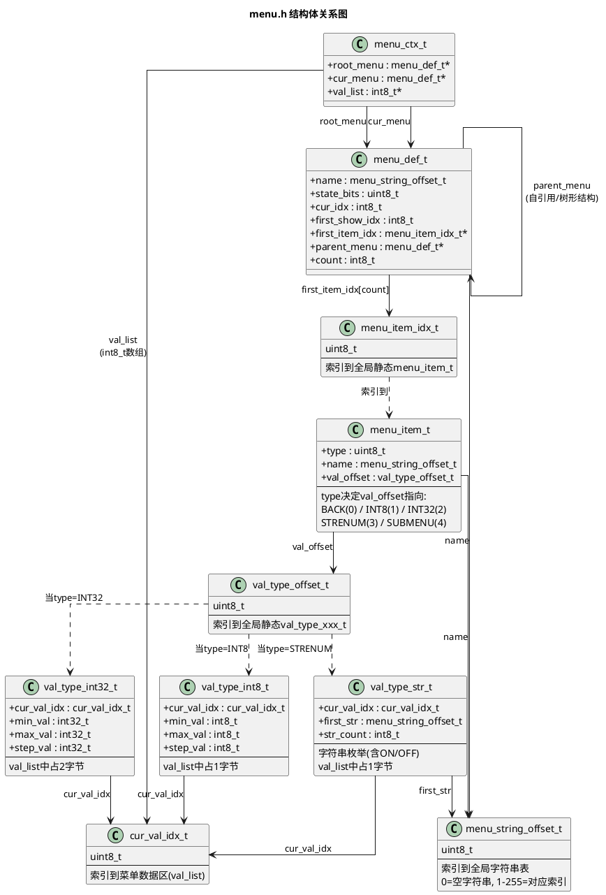

```plantuml
@startuml
skinparam classAttributeIconSize 0
skinparam linetype ortho

title menu.h 结构体关系图

' ===== 类型别名 =====
class "menu_string_offset_t" as MSO {
  uint8_t
  --
  索引到全局字符串表
  0=空字符串, 1-255=对应索引
}

class "cur_val_idx_t" as CVI {
  uint8_t
  --
  索引到菜单数据区(val_list)
}

class "val_type_offset_t" as VTO {
  uint8_t
  --
  索引到全局静态val_type_xxx_t
}

class "menu_item_idx_t" as MII {
  uint8_t
  --
  索引到全局静态menu_item_t
}

' ===== 值类型结构体 =====
class "val_type_int32_t" as VTI32 {
  +cur_val_idx : cur_val_idx_t
  +min_val : int32_t
  +max_val : int32_t
  +step_val : int32_t
  --
  val_list中占2字节
}

class "val_type_int8_t" as VTI8 {
  +cur_val_idx : cur_val_idx_t
  +min_val : int8_t
  +max_val : int8_t
  +step_val : int8_t
  --
  val_list中占1字节
}

class "val_type_str_t" as VTS {
  +cur_val_idx : cur_val_idx_t
  +first_str : menu_string_offset_t
  +str_count : int8_t
  --
  字符串枚举(含ON/OFF)
  val_list中占1字节
}

' ===== 菜单条目 =====
class "menu_item_t" as MI {
  +type : uint8_t
  +name : menu_string_offset_t
  +val_offset : val_type_offset_t
  --
  type决定val_offset指向:
  BACK(0) / INT8(1) / INT32(2)
  STRENUM(3) / SUBMENU(4)
}

' ===== 菜单定义 =====
class "menu_def_t" as MD {
  +name : menu_string_offset_t
  +state_bits : uint8_t
  +cur_idx : int8_t
  +first_show_idx : int8_t
  +first_item_idx : menu_item_idx_t*
  +parent_menu : menu_def_t*
  +count : int8_t
}

' ===== 菜单上下文 =====
class "menu_ctx_t" as MC {
  +root_menu : menu_def_t*
  +cur_menu : menu_def_t*
  +val_list : int8_t*
}

' ===== 关系 =====

' val_type 使用 cur_val_idx_t 索引 val_list
VTI32 --> CVI : cur_val_idx
VTI8 --> CVI : cur_val_idx
VTS --> CVI : cur_val_idx

' val_type_str_t 使用字符串偏移
VTS --> MSO : first_str

' menu_item_t 的关系
MI --> MSO : name
MI --> VTO : val_offset

' val_type_offset_t 可指向三种值类型
VTO ..> VTI8 : 当type=INT8
VTO ..> VTI32 : 当type=INT32
VTO ..> VTS : 当type=STRENUM

' menu_def_t 的关系
MD --> MSO : name
MD --> MII : first_item_idx[count]
MD --> MD : parent_menu\n(自引用/树形结构)

' menu_item_idx_t 索引 menu_item_t
MII ..> MI : 索引到

' menu_ctx_t 的关系
MC --> MD : root_menu
MC --> MD : cur_menu
MC --> CVI : val_list\n(int8_t数组)

@enduml
```